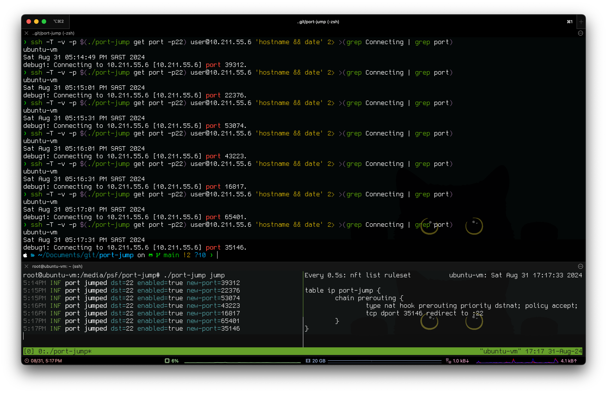

# port-jump

Some security by obscurity using "port-jumping". A silly PoC to use HOTP to update port numbers to a service as time progresses.


**WARNING:** This is a PoC-scratching-an-itch project. Don't actually use this somewhere important, okay?

## introduction

Port jump is literally a post-wake up "hmmm" idea that I wanted to PoC. This code is that result.

The idea is simple. Instead of having a service like SSH listen on port 22 (or whatever port you use) forever, what if that port number changed every `$interval` seconds? Sounds like an excellent security by obscurity choice! This project does that by implementing an HOTP generator based on a secret, generating valid TCP port numbers within a range to use.

Using a simple config file in `~/.config/port-jump/config.yml`, shared secrets and port mappings are read, and rotated on a configured interval, just like a TOTP does! An example configuration is:

```yml
jumps:
  - enabled: false
    dstport: 23
    interval: 30
    sharedsecret: YIHWTYNSBRGWFPR4
  - enabled: true
    dstport: 22
    interval: 30
    sharedsecret: FWX2CC3PLA4ZYGCI
  - enabled: true
    dstport: 80
    interval: 60
    sharedsecret: HPQY7R45TFSZWTST
```

Assuming we're targeting SSH, you can now configure the port by running `port-jump get port` as follows:

```console
ssh -p $(port-jump get port -p22) user@10.211.55.6
```

Pretty cool!

## example run

In the below image, I have an ubuntu server running `port-jump jump` that reads the configuration file and updates `nftables` to NAT incoming connections to port 22 at the bottom. At the top is a macOS SSH client that uses the `port-jump get port` command to get the current port to use to connect to the remote SSH service. This command is run every 30 seconds as the configured interval changes the port.



## building & installing

How you want to install this depends on what you prefer. You can run it as is, as a [systemd unit](#systemd-unit) or as a [docker container](#docker). Do what works for you.

In most cases you'd need to build the program though, do that with:

```console
go build -o port-jump
```

You can also install it using which would typically install `port-jump` to `GOBIN`.

```console
go install github.com/leonjza/port-jump@latest
```

### systemd unit

A systemd [unit](./port-jump.service) is available that will boot start the `port-jump jump` command as a systemd service. To install, follow the below steps:

*Note:* If you have no jumps configured int he configuration file, the service will exit. Be sure to check out `~/.config/port-jump/config.yml` to configure your jumps.

- Copy the service over to something like `/etc/systemd/system/port-jump.servive`
- Make sure the contents reflects the correct paths where you put your build of `port-jump`.
- Reload the available daemons with `systemctl daemon-reload`.
- Enable the service with `systemctl enable port-jump.service`.
- Start the service with `systemctl start port-jump.service`.
- Check out the status of `port-jump` with `systemctl status port-jump.service`.
- Check out the logs with `journalctl -fu port-jump.service`.

### docker

It's possible to run `port-jump` using Docker. It’s going to require the `--privileged` flag which is generally discouraged. However, assuming you trust this code and understand what that flag means, you could get a docker container up and running with:

```console
# build the container with
docker build -t portjump:local .

# run with
docker run --rm -it -v /root/.config/port-jump/config.yml:/root/.config/port-jump/config.yml --network host --privileged portjump:local jump
```

Note the volume mapping with `-v`. This is where the jump mapping lives.

## todo

This is a PoC, but to give you an idea of stuff to do includes:

- Adding a floor / ceiling limit to a jump so that ports do not overlap with existing services that may already be running.
- Add some more firewall support. Right now only `nftables` is supported on Linux.
